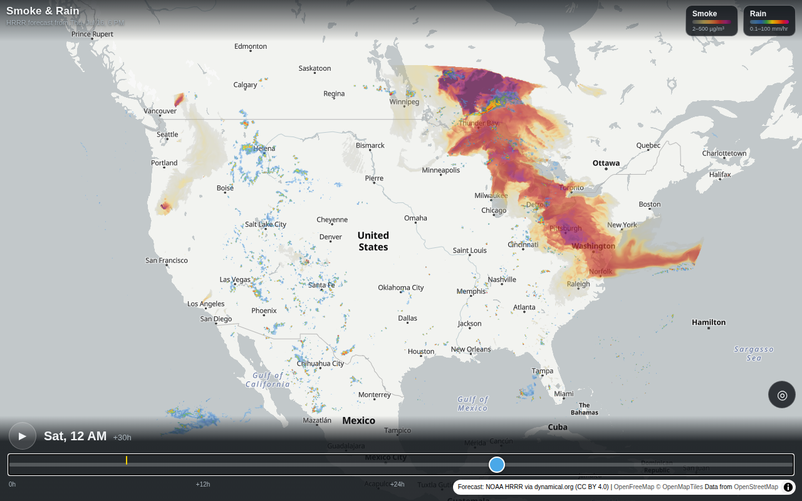
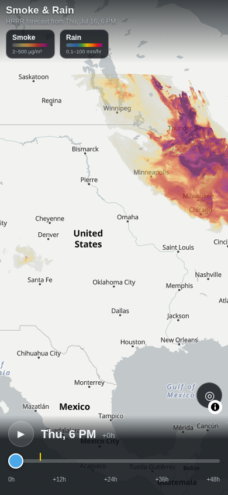

# Smoke & Rain — 48-hour HRRR forecast map

A static single-page app that animates the next 48 hours of NOAA HRRR
forecasts — **near-surface smoke** and **precipitation rate** — on a map
centered on your location. All data is read directly in the browser from
[dynamical.org](https://dynamical.org)'s icechunk store; there is no backend.




## How it works

1. **[icechunk-js](https://github.com/EarthyScience/icechunk-js) + [zarrita](https://github.com/manzt/zarrita.js)**
   open the [NOAA HRRR forecast, 48 hour, virtual](https://dynamical.org/catalog/noaa-hrrr-forecast-48-hour-virtual/)
   icechunk repository straight from S3. Chunks are *virtual*: byte ranges
   into NOAA's original GRIB2 files on `noaa-hrrr-bdp-pds` (both buckets are
   public + CORS-enabled).
2. A **pure-TypeScript GRIB2 decoder** (`src/lib/grib/decoder.ts`, registered
   as the store's `gribberish` zarr codec) decodes complex-packed messages
   (DRS templates 5.0/5.2/5.3) — no WASM, no COOP/COEP headers needed. Unit
   tests cross-validate it element-wise against the native
   [gribberish](https://github.com/mpiannucci/gribberish) library.
3. A **Web Worker** owns the store, finds the latest complete forecast init
   (1-byte manifest probes), and streams frames progressively (every 6 h
   first — playable after ~5 MB — then 3 h, then hourly; ~35 MB total).
   Fields are quantized to log-scale bytes (block-max downsampled 2× on
   phones).
4. Frames render through a precomputed **Lambert-conformal → web-mercator
   index map** into MapLibre canvas sources: each repaint is a gather + RGBA
   LUT with byte-space crossfade, so scrubbing and animation stay smooth on
   mobile GPUs.

## Develop

```bash
npm install
npm run dev            # live app against the real store
npm run test           # unit tests (decoder vs gribberish oracle, projection, colormaps, ...)
npm run test:e2e       # Playwright: behavior + visual snapshots, offline via recorded fixtures
npm run lint && npm run typecheck
```

Useful dev scripts:

```bash
node --experimental-strip-types scripts/spike-read.ts     # end-to-end store read + network stats
node --experimental-strip-types scripts/inspect-store.ts  # dump store hierarchy/metadata
node scripts/screenshot.mjs                               # screenshot the running dev server
npm run fetch-grib-fixtures                               # refresh unit-test GRIB messages (pinned date)
npm run record-fixtures                                   # re-record e2e HTTP fixtures (updates init time)
```

### Testing notes

- Unit tests treat native gribberish as an **oracle**: real HRRR PRATE/MASSDEN
  messages are decoded by both implementations and compared element-wise;
  projection math is checked against gribberish's computed lat/lon grid.
- Playwright replays recorded store traffic (`tests/fixtures/http/`) and a
  local Natural Earth basemap style, with pinned clock, timezone, and
  geolocation — fully offline and deterministic. Visual snapshots run on
  chromium (desktop) and webkit (iPhone 14 viewport). After changing
  rendering intentionally, refresh with `npm run test:e2e:update`.
- CI runs in the `mcr.microsoft.com/playwright` image matching the pinned
  `@playwright/test` version so snapshots render identically.

## Deploy (Cloudflare)

The build is fully static — any static host works.

```bash
npm run build
npx wrangler pages deploy dist
```

Or connect the repo to Cloudflare Pages with build command `npm run build`
and output directory `dist`. `public/_headers` sets immutable caching for
hashed assets. No environment variables or server functions are required.

## Data & attribution

- Forecast data: [NOAA HRRR](https://rapidrefresh.noaa.gov/hrrr/), processed
  and served by [dynamical.org](https://dynamical.org)
  ([CC BY 4.0](https://creativecommons.org/licenses/by/4.0/)); store version
  pinned in `src/config.ts`.
- Basemap: [OpenFreeMap](https://openfreemap.org) /
  © [OpenMapTiles](https://openmaptiles.org) data from
  © [OpenStreetMap](https://www.openstreetmap.org/copyright) contributors.
- Smoke is HRRR's near-surface smoke tracer (`mass_density_8m`, µg/m³, ~8 m
  AGL); rain is instantaneous precipitation rate (`precipitation_rate_surface`,
  mm/hr). New forecasts are published every 6 hours (00/06/12/18 UTC); the app
  always shows the most recent complete run.
